  

<h1 align="center">Joel Pan</h1>

  <strong>Student · Software builder · Technology creator</strong>

  Exploring mathematics, computer science, artificial intelligence, 
  and the craft of turning ideas into thoughtful software.

  <a href="#about-me">About</a> ·
  <a href="#what-i-care-about">Interests</a> ·
  <a href="#what-i-build">Work</a> ·
  <a href="https://panjoel812.github.io">Notes</a>

 

## About me

I'm **Joel Pan**, also known as **Panjoel**. I'm a student who enjoys moving between theory and practice: understanding a mathematical idea, expressing it as an algorithm, implementing it as software, and finally explaining it in language other people can use.

My interests sit at the intersection of **mathematics, computer science, artificial intelligence, and product design**. I am especially drawn to problems that require both rigorous thinking and creative construction—from algorithms and intelligent systems to small tools with carefully considered interfaces.

I learn best by building. A concept becomes real to me when I can test it, find its limits, improve it, and write down what I discovered.

## What I care about

- **Strong foundations** — mathematics, algorithms, and first-principles understanding before abstraction.
- **Intelligent systems** — machine learning, deep learning, AI agents, and better ways for software to reason and assist.
- **Useful engineering** — turning an idea into a reliable system instead of stopping at a convincing demo.
- **Clear communication** — making difficult knowledge easier to understand without removing its depth.
- **Thoughtful design** — software should not only work; it should feel calm, coherent, and respectful of its user.

## What I build

### Poblumi · 啵露米

[Poblumi](https://panjoel812.github.io) is my personal knowledge space. I use it to collect mathematical notes, computer science ideas, programming practice, and the lessons hidden inside things I build. Its goal is simple: make serious learning feel a little more approachable and alive.

### Learning projects and experiments

I turn new ideas into small programs, prototypes, and technical experiments. Some begin with an algorithm; others begin with a question about AI, the web, or how an interface should behave. The useful ones gradually become public projects and notes.

### Technical writing

Writing is part of how I learn. My notes are mainly in Chinese and cover mathematics, data structures, algorithms, Python, software engineering, and the occasional exploration that does not fit neatly into one category.

## Current interests

- **AI and machine learning:** deep learning, language models, agents, efficient intelligent systems, and AI for science.
- **Algorithms and systems:** data structures, performance, system design, and the path from a clean model to dependable code.
- **Mathematics:** the structures and proofs that make computational ideas precise.
- **Human-centered software:** interfaces, motion, accessibility, and the small details that make technology easier to trust.

## Working set

**Languages** · `Python` `C++` `JavaScript`

**AI and data** · `PyTorch` `Deep Learning` `LLMs` `AI Agents`

**Web** · `React` `Next.js` `Flask`

**Foundations** · `Algorithms` `Data Structures` `Git` `macOS` `Linux`

## How I work

1. Start with the underlying question, not the fashionable tool.
2. Reduce the idea to something small enough to test honestly.
3. Build, measure, and revise when reality disagrees.
4. Write down the result so the next iteration starts from a clearer place.
5. Polish the details that make a working system feel considered.

## Right now

- Strengthening my foundations in mathematics and deep learning.
- Exploring AI agents, efficient intelligent systems, and scientific applications of AI.
- Building Poblumi into a clearer and more welcoming knowledge space.
- Publishing what I learn through code and long-form technical notes.

> Code is the language. Mathematics is the foundation. Curiosity is the engine.

## Elsewhere

- [Poblumi · field notes and essays](https://panjoel812.github.io)
- [Public repositories and experiments](https://github.com/panjoel812?tab=repositories)

  
<strong>GitHub activity</strong>

   
  <picture>
    <source media="(prefers-color-scheme: dark)" srcset="https://github-readme-stats.vercel.app/api?username=panjoel812&amp;show_icons=true&amp;hide_border=true&amp;bg_color=00000000&amp;title_color=F7F8FC&amp;text_color=A6ABBA&amp;icon_color=67E8F9&amp;rank_icon=github" />
    <source media="(prefers-color-scheme: light)" srcset="https://github-readme-stats.vercel.app/api?username=panjoel812&amp;show_icons=true&amp;hide_border=true&amp;bg_color=00000000&amp;title_color=171923&amp;text_color=565E70&amp;icon_color=7C3AED&amp;rank_icon=github" />
    
  </picture>

 

  Stay curious. Build what deserves to exist.

