  

    

  <a href="#about"><strong>About</strong></a>&nbsp;&nbsp;·&nbsp;&nbsp;<a href="#selected-work"><strong>Work</strong></a>&nbsp;&nbsp;·&nbsp;&nbsp;<a href="#focus"><strong>Focus</strong></a>&nbsp;&nbsp;·&nbsp;&nbsp;<a href="#public-lab"><strong>Lab</strong></a>&nbsp;&nbsp;·&nbsp;&nbsp;<a href="https://panjoel812.github.io"><strong>Notes ↗</strong></a>

 

## About

Hi, I'm **Joel Pan**—**Panjoel** online. I'm a student working across mathematics, computer science, artificial intelligence, and product design. I enjoy following an idea through its whole life: from a question, to a model, to working software, and finally to an explanation someone else can use.

I learn by making ideas answer to reality. I start from first principles, reduce the problem to an honest experiment, study where it breaks, and keep refining until the result becomes useful, reliable, and clear. That loop connects nearly everything here—from algorithms and AI experiments to interfaces and technical notes.

 

  

 

## Selected work

A selection of public systems where I explore local-first software, reliable AI, reproducible research, and expressive interfaces.

A local-first capture system spanning a desktop studio, browser extension, and MCP tools. **[Explore the repository ↗](https://github.com/panjoel812/Synapse-Shredder)**

  

An on-device inspection and calibrated-metrology system built around multi-view reliability, human review, and local evidence. **[Explore the repository ↗](https://github.com/panjoel812/UrbanVision-Risk)**

  

A reproducible plant-leaf classification study with controlled benchmarks, calibration, error analysis, Grad-CAM, and interactive demos. **[Explore the repository ↗](https://github.com/panjoel812/PlantDiseaseAI)**

  

A reusable 3D time-locked message capsule with network-time unlocking and privacy-safe local overrides. **[Live experience ↗](https://chronos-orbit.vercel.app)** · **[Source ↗](https://github.com/panjoel812/Chronos-orbit)**

 

## Focus

**Foundations** — Mathematics, algorithms, data structures, and the first-principles thinking that makes computational ideas precise.

**Intelligent systems** — Deep learning, language models, AI agents, efficient architectures, and scientific applications of artificial intelligence.

**Human-centered software** — Reliable engineering, thoughtful interfaces, accessibility, and explanations that preserve depth while making difficult ideas easier to approach.

## Public lab

- **[Telegraph-Image ↗](https://github.com/panjoel812/Telegraph-Image)** — A self-hosted Cloudflare Pages file host combining Telegram or R2 storage, a D1 admin console, access controls, and a PicGo-compatible upload API.
- **[Words-Memory ↗](https://github.com/panjoel812/Words-Memory)** — A responsive, local-first vocabulary learning app with forgetting-curve review, progress tracking, and offline storage.
- **[Poblumi · 啵露米 ↗](https://panjoel812.github.io)** — My public knowledge garden for mainly Chinese notes on mathematics, computer science, programming, and lessons from building. **[Source ↗](https://github.com/panjoel812/panjoel812.github.io)**

## Toolkit

My everyday toolkit centers on `Python`, `C++`, `PyTorch`, `JavaScript`, `React`, `Next.js`, and `Flask`. I work across macOS and Linux with Git, choosing tools around the question rather than the trend.

  <a href="https://panjoel812.github.io"><strong>Read the notes ↗</strong></a>
  &nbsp;&nbsp;·&nbsp;&nbsp;
  <a href="https://github.com/panjoel812?tab=repositories"><strong>See all public repositories ↗</strong></a>

 

  Stay curious. Build what deserves to exist.

