  

    

  <a href="#about"><strong>About</strong></a>
  &nbsp;&nbsp;·&nbsp;&nbsp;
  <a href="#focus"><strong>Focus</strong></a>
  &nbsp;&nbsp;·&nbsp;&nbsp;
  <a href="#building"><strong>Building</strong></a>
  &nbsp;&nbsp;·&nbsp;&nbsp;
  <a href="#toolkit"><strong>Toolkit</strong></a>
  &nbsp;&nbsp;·&nbsp;&nbsp;
  <a href="https://panjoel812.github.io"><strong>Notes ↗</strong></a>

 

## About

Hi, I'm **Joel Pan**—**Panjoel** online. I'm a student working across mathematics, computer science, artificial intelligence, and product design. I enjoy following an idea through its whole life: from a question, to a model, to working software, and finally to an explanation someone else can use.

I learn by making ideas answer to reality. I start from first principles, reduce the problem to an honest experiment, study where it breaks, and keep refining until the result becomes useful, reliable, and clear. That loop connects nearly everything here—from algorithms and AI experiments to interfaces and technical notes.

 

  

 

## Focus

<strong>Foundations</strong> 
Mathematics, algorithms, data structures, and the first-principles thinking that makes computational ideas precise.

<strong>Intelligent systems</strong> 
Deep learning, language models, AI agents, efficient architectures, and scientific applications of artificial intelligence.

<strong>Human-centered software</strong> 
Reliable engineering, thoughtful interfaces, accessibility, and explanations that preserve depth while making difficult ideas easier to approach.

## Building

### Poblumi · 啵露米

[Poblumi](https://panjoel812.github.io) is my personal knowledge space—a growing collection of mainly Chinese notes on mathematics, computer science, programming, and the lessons hidden inside things I build.

I want it to make serious learning feel clearer, warmer, and more alive without making the ideas themselves less rigorous.

### Experiments

I use small programs and prototypes as instruments for thinking. Some begin with an algorithm; others with a question about AI, the web, or how an interface should behave. The useful ones gradually become public projects, tools, or notes.

### Right now

I'm strengthening my foundations in mathematics and deep learning, exploring agents and efficient intelligent systems, and refining Poblumi into a more welcoming place to learn.

## Toolkit

My everyday toolkit centers on `Python`, `C++`, `PyTorch`, `JavaScript`, `React`, `Next.js`, and `Flask`. I work across macOS and Linux with Git, choosing tools around the question rather than the trend.

> Code is the language. Mathematics is the foundation. Curiosity is the engine.

  <a href="https://panjoel812.github.io"><strong>Read the notes ↗</strong></a>
  &nbsp;&nbsp;·&nbsp;&nbsp;
  <a href="https://github.com/panjoel812?tab=repositories"><strong>Explore the work ↗</strong></a>

  
<strong>GitHub activity</strong>

   
  <picture>
    <source media="(prefers-color-scheme: dark)" srcset="https://github-readme-stats.vercel.app/api?username=panjoel812&amp;show_icons=true&amp;hide_border=true&amp;bg_color=00000000&amp;title_color=F7F8FC&amp;text_color=A6ABBA&amp;icon_color=67E8F9&amp;rank_icon=github" />
    <source media="(prefers-color-scheme: light)" srcset="https://github-readme-stats.vercel.app/api?username=panjoel812&amp;show_icons=true&amp;hide_border=true&amp;bg_color=00000000&amp;title_color=171923&amp;text_color=565E70&amp;icon_color=7C3AED&amp;rank_icon=github" />
    
  </picture>

 

  Stay curious. Build what deserves to exist.

